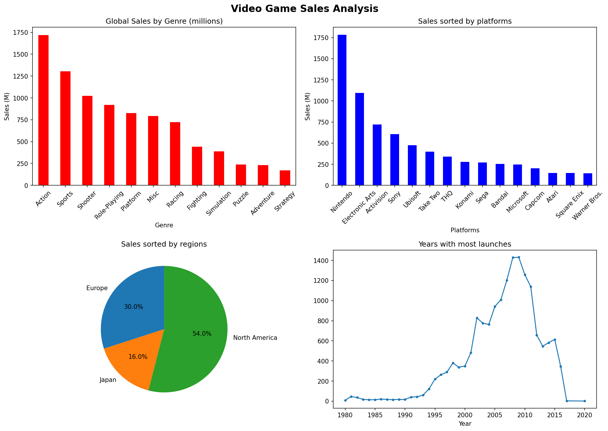

# 🎮 GameAnalysis
Personal project made to remember basic programming skills.
Exploratory data analysis in 16,000+ games, uncovering trends in sales, genres and publishers

## 📊 Key Findings
- Action is the best-selling genre globally
- 2007–2010 was the peak period for game releases
- Post-2010 saw a sharp decline in new game launches
- North America accounts for ~49% of global sales
- PS2 is the highest-grossing platform of all time in this dataset
- Nintendo leads the global sales market with a significant gap over competitors
- Japan overwhelmingly dominates RPG sales compared to other regions

## 🛠️ Tech Stack
- Python 3.x
- Pandas — data manipulation
- Matplotlib — visualizations

## 📁 Dataset
[Video Game Sales - Kaggle](https://www.kaggle.com/datasets/gregorut/videogamesales)  
16,598 games with sales data across NA, EU, JP and other regions.

## 🚀 How to Run
```bash
pip install pandas matplotlib
python analysis.py
```

## Charts
